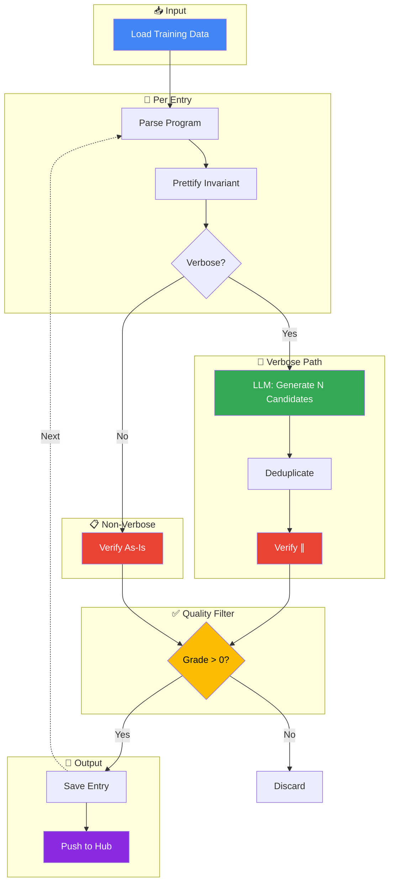

# Data Curation Pipeline

## Pipeline Summary

| Stage | Description |
|-------|-------------|
| **Load** | Load JSON training data with invariants |
| **Parse** | Parse C program AST once per entry |
| **Prettify** | Clean and format invariant text |
| **Verbose Check** | `min_disjuncts ≤ \|\| count ≤ max_disjuncts` AND `min_chars ≤ len ≤ max_chars` |
| **LLM Generation** | Generate N simplified candidates via Together API |
| **Deduplicate** | Remove exact duplicates by normalized content |
| **Verify** | Run UAutomizer: Correctness ∥ Usefulness (check speedup) |
| **Filter** | Keep only `quality_grade > 0` |
| **Save** | Write qualifying entries to JSON |
| **Hub** | Push dataset to HuggingFace Hub |

## Quality Grades

| Grade | Criteria |
|-------|----------|
| 0 | Not correct |
| 1 | Correct but target property doesn't hold |
| 2 | Correct + target holds, no speedup |
| 3 | Correct + target holds + speedup ✓ |
