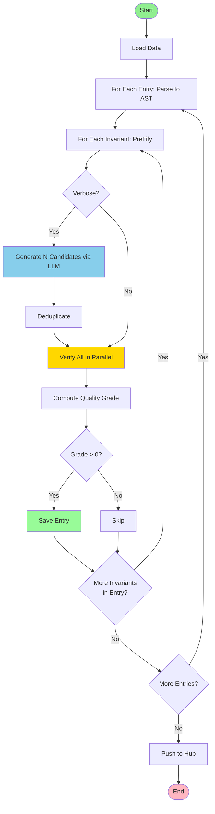

# Preprocess GT Invariants Parallel - Data Pipeline

## Main Pipeline Flow

## Key Components

### Quality Grading System
- **Grade 0**: Not correct (syntactically invalid or verification failed)
- **Grade 1**: Correct but target property doesn't hold
- **Grade 2**: Correct, target holds, but no speedup
- **Grade 3**: Correct, target holds, has speedup

### Parallel Processing
- **LLM Generation**: N candidates generated in single API call
- **Verification**: All candidates verified in parallel (ThreadPoolExecutor)
- **Per-Candidate Checks**: Correctness + Usefulness run in parallel (2 workers)

### Verbose Detection
- Checks disjunct count (||) and character length
- Only verbose invariants get LLM simplification
- Non-verbose invariants verified as-is
